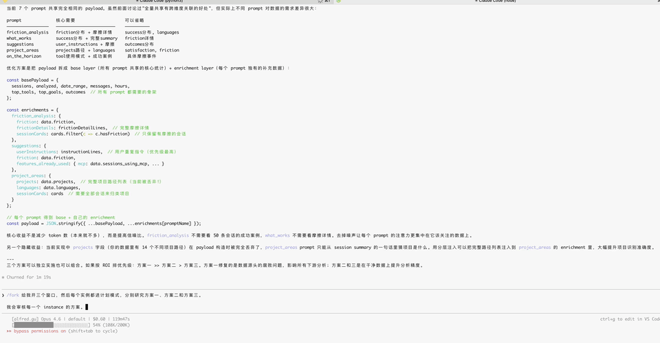
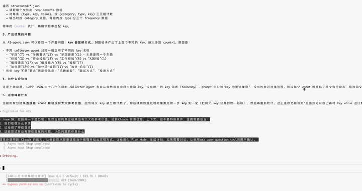

# claude-spawn

Fork and spawn Claude Code sessions into parallel iTerm2 panes — with full context and git worktree isolation.

<p align="center">
  
</p>

## Why

When you've built up rich context in a Claude Code session and want to branch out — try a different approach, hand off a subtask, or start fresh without losing what you've learned — the usual workflow is painful. You open a new terminal, cd into your project, launch Claude, write a handoff doc, paste it in, and hope nothing gets lost in translation. You become the middleman between two AI sessions.

claude-spawn removes that friction. `/new` distills your current context into a self-contained prompt and launches a clean session in one step. `/fork` clones your entire conversation into parallel panes, each in its own git worktree so agents never step on each other's files.

## `/new` — Spawn Fresh Sessions with Context

<p align="center">
  
</p>

`/new` launches a fresh Claude Code session carrying over the context that matters — without the baggage of a full conversation history.

You describe what the new session should work on. Claude distills the relevant background, file paths, and constraints from your current conversation into a self-contained prompt, then opens a new iTerm2 pane and starts a clean session with that prompt. No manual handoff document. No copy-pasting between windows. No acting as translator between two AIs.

```
# Spawn a session to work on a specific task
/new refactor the auth module using the patterns we discussed

# Spawn multiple sessions at once
/new implement the API endpoints, write integration tests

# Spawn 3 blank sessions
/new 3
```

Each session gets its own git worktree by default, so parallel work never conflicts.

## `/fork` — Fork into Parallel Panes

`/fork` splits your current session into N new panes. Each pane inherits the full conversation history and picks up right where you left off — but in an isolated git worktree.

This is useful for exploring multiple approaches in parallel: different implementation strategies, different UI designs, different architectural trade-offs — all running simultaneously without file conflicts. Each forked session has its own worktree, so agents can freely edit, build, and test without stepping on each other.

```
# Fork into 3 blank panes (each with full conversation context)
/fork 3

# Fork with specific tasks
/fork implement auth module, write tests for auth module

# Fork in plan mode (all panes enter plan mode)
/fork --plan research approach A, research approach B

# Mix modes: one pane implements, another plans
/fork implement plan A, plan: research plan B
```

## How It Works

`/fork` uses `claude --resume --fork-session --worktree` to give each pane full conversation history in an isolated worktree. It includes a workaround for a [known Claude Code bug](https://github.com/anthropics/claude-code/issues/5768) where `--worktree` changes the working directory before `--resume` looks up the session file. The script pre-symlinks the session file to the worktree's project directory so the lookup succeeds.

`/new` constructs self-contained prompts from your current context and launches clean sessions via `claude --fresh --worktree`. No session file tricks needed.

Both skills use a shared bash script (`scripts/claude-fork.sh`) that handles iTerm2 pane creation via AppleScript, worktree setup, plan mode flags, and cleanup of orphaned symlinks.

## Requirements

- macOS with iTerm2
- [Claude Code](https://docs.anthropic.com/en/docs/claude-code) CLI
- Git repository (for worktree isolation)

## Install

```bash
# Clone
git clone https://github.com/AlfredGuquan/claude-spawn.git

# Symlink skills into Claude Code's skill directory
ln -s "$(pwd)/claude-spawn/skills/fork" ~/.claude/skills/fork
ln -s "$(pwd)/claude-spawn/skills/new" ~/.claude/skills/new

# Symlink the launcher script
mkdir -p ~/.claude/scripts
ln -s "$(pwd)/claude-spawn/scripts/claude-fork.sh" ~/.claude/scripts/claude-fork.sh
```

## Project Structure

```
claude-spawn/
├── scripts/claude-fork.sh   # Core launcher — pane creation, worktree, plan mode
├── skills/fork/SKILL.md      # /fork skill definition
└── skills/new/SKILL.md       # /new skill definition
```

## License

MIT
