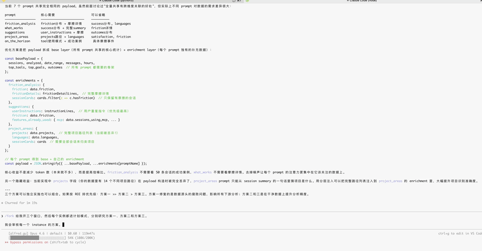
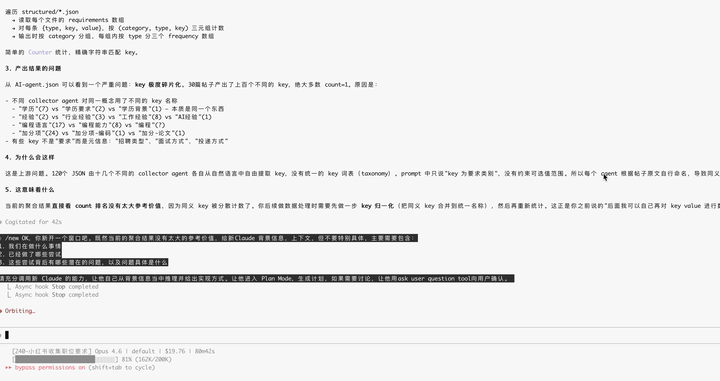

# claude-spawn

[中文版](README_zh.md)

Fork and spawn coding agent sessions into parallel tmux panes or windows — with full context and git worktree isolation. Supports Claude Code (default), OpenAI CodeX, and Google Gemini CLI.

<p align="center">
  
</p>

## Why

When you've built up rich context in a Claude Code session and want to branch out — try a different approach, hand off a subtask, or start fresh without losing what you've learned — the usual workflow is painful. You open a new terminal, cd into your project, launch Claude, write a handoff doc, paste it in, and hope nothing gets lost in translation. You become the middleman between two AI sessions.

claude-spawn removes that friction. `/new` distills your current context into a self-contained prompt and launches a clean session in one step. `/fork` clones your entire conversation into parallel panes, each in its own git worktree so agents never step on each other's files.

## `/new` — Spawn Fresh Sessions with Context

<p align="center">
  
</p>

`/new` launches a fresh agent session carrying over the context that matters — without the baggage of a full conversation history.

You describe what the new session should work on. Claude distills the relevant background, file paths, and constraints from your current conversation into a self-contained prompt, then opens a new tmux window and starts a clean session with that prompt. No manual handoff document. No copy-pasting between windows. No acting as translator between two AIs.

```
# Spawn a session to work on a specific task
/new refactor the auth module using the patterns we discussed

# Spawn multiple sessions at once
/new implement the API endpoints, write integration tests

# Spawn 3 blank sessions
/new 3

# Route to a different engine
/new codex: implement the REST API
/new gemini: build the dashboard UI

# Mixed dispatch — different engines in one call
/new write tests for auth, codex: implement the API, gemini: build the login page

# Spawn in a separate tmux session (unrelated work)
/new --session-name db-migration plan the schema changes
```

Each Claude session gets its own git worktree by default, so parallel work never conflicts.

## `/fork` — Fork into Parallel Panes

`/fork` splits your current session into N new panes within the current tmux window. Each pane inherits the full conversation history and picks up right where you left off — but in an isolated git worktree.

This is useful for exploring multiple approaches in parallel: different implementation strategies, different UI designs, different architectural trade-offs — all running simultaneously without file conflicts. Each forked session has its own worktree, so agents can freely edit, build, and test without stepping on each other.

```
# Fork into 3 blank panes (each with full conversation context)
/fork 3

# Fork with specific tasks
/fork implement auth module, write tests for auth module

# Fork in plan mode (all panes enter plan mode)
/fork --plan research approach A, research approach B

# Mix modes: one pane implements, another plans
/fork implement plan A, plan: research plan B

# Fork as independent windows instead of panes
/fork --window implement plan A, research plan B

# Fork with watch mode — get notified when children finish
/fork --watch research approach A, research approach B
```

## Pane vs Window Mode

By default, `/fork` creates **panes** (splits within the current window) and `/new` creates **windows** (separate tmux tabs). You can override this with `--window` or `--pane` flags.

Pane layout: parent on the left half, children stacked on the right (tmux main-vertical). Max 4 child panes per window — excess automatically overflow to windows.

## Watch Mode

Pass `--watch` to have the parent session monitor child progress. Each child reports status via a Stop hook when it completes a turn. The parent can read these status files and send follow-up instructions.

```
# Fork with watch — parent waits for results
/fork --watch research approach A, research approach B

# Send follow-up to a specific child
bash ~/.claude/scripts/send-to-pane.sh <child-id> "now implement approach A"
```

## Hierarchical Naming

Sessions are automatically numbered in a tree structure. Forking from window `1:research` creates children `1.1:try-redis`, `1.2:try-postgres`, etc. Use `bash ~/.claude/scripts/claude-tree.sh` to visualize the full session tree.

## Multi-Engine Support

By default, tasks are routed to Claude Code. You can prefix tasks with `codex:` or `gemini:` to use OpenAI CodeX or Google Gemini CLI instead. Engine selection is per-task, so you can mix engines in a single `/new` call.

| Engine | Prefix | Plan mode | Worktree |
|--------|--------|-----------|----------|
| Claude Code | *(default)* | `--permission-mode plan` | Yes |
| OpenAI CodeX | `codex:` | `--sandbox read-only` | No |
| Google Gemini | `gemini:` | `--approval-mode plan` | No |

## How It Works

`/fork` uses `claude --resume --fork-session --worktree` to give each pane full conversation history in an isolated worktree. It includes a workaround for a [known Claude Code bug](https://github.com/anthropics/claude-code/issues/5768) where `--worktree` changes the working directory before `--resume` looks up the session file. The script pre-symlinks the session file to the worktree's project directory so the lookup succeeds.

`/new` constructs self-contained prompts from your current context and launches clean sessions via `claude --fresh --worktree`. No session file tricks needed.

Both skills use a shared bash script (`scripts/claude-fork.sh`) that handles tmux pane/window creation, worktree setup, plan mode flags, watch mode, engine dispatch, hierarchical naming, and cleanup of orphaned symlinks.

## Requirements

- macOS or Linux with [tmux](https://github.com/tmux/tmux)
- [Claude Code](https://docs.anthropic.com/en/docs/claude-code) CLI
- Git repository (for worktree isolation)
- [fswatch](https://github.com/emcrisostomo/fswatch) (for `--watch` mode)
- *(Optional)* [OpenAI CodeX](https://github.com/openai/codex) CLI for `codex:` engine
- *(Optional)* [Google Gemini](https://github.com/google-gemini/gemini-cli) CLI for `gemini:` engine

## Install

```bash
# Clone
git clone https://github.com/AlfredGuquan/claude-spawn.git

# Symlink skills into Claude Code's skill directory
ln -s "$(pwd)/claude-spawn/skills/fork" ~/.claude/skills/fork
ln -s "$(pwd)/claude-spawn/skills/new" ~/.claude/skills/new

# Symlink scripts
mkdir -p ~/.claude/scripts
ln -s "$(pwd)/claude-spawn/scripts/claude-fork.sh" ~/.claude/scripts/claude-fork.sh
ln -s "$(pwd)/claude-spawn/scripts/send-to-pane.sh" ~/.claude/scripts/send-to-pane.sh
ln -s "$(pwd)/claude-spawn/scripts/claude-tree.sh" ~/.claude/scripts/claude-tree.sh
```

## Project Structure

```
claude-spawn/
├── scripts/
│   ├── claude-fork.sh      # Core launcher — pane/window creation, worktree, watch mode
│   ├── send-to-pane.sh     # Send messages to child panes
│   └── claude-tree.sh      # Visualize the session tree
├── skills/
│   ├── fork/SKILL.md       # /fork skill definition
│   └── new/SKILL.md        # /new skill definition
```

## License

MIT
